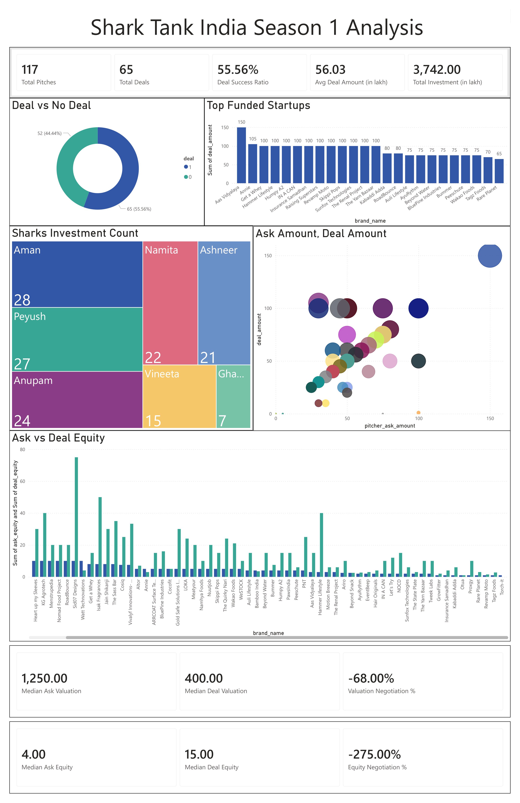

# Shark Tank India Season 1 – Data Analysis

## Project Overview

This project analyzes **Shark Tank India Season 1 startup pitches** to understand investment trends, negotiation patterns, and investor behavior.
The analysis was performed using **SQL, Python, and Power BI** to generate insights from the dataset.

---

## Dataset

The dataset contains **117 startup pitches** with information about:

* Startup name and idea
* Founder ask amount and equity
* Final deal amount and equity
* Shark participation and investments

---

## Key Insights

* **117 startups pitched**, and **65 secured deals** (≈55.6% success rate).
* Total investment in Season 1 was **₹37.42 Crores**.
* Startup valuations decreased by about **68% during negotiations**.
* Founders increased equity from **4% to around 15%** to secure funding.

---

## Objective

The objective of this project is to demonstrate **data analysis, KPI generation, and business insight extraction** using startup investment data.

---

## Dashboard

